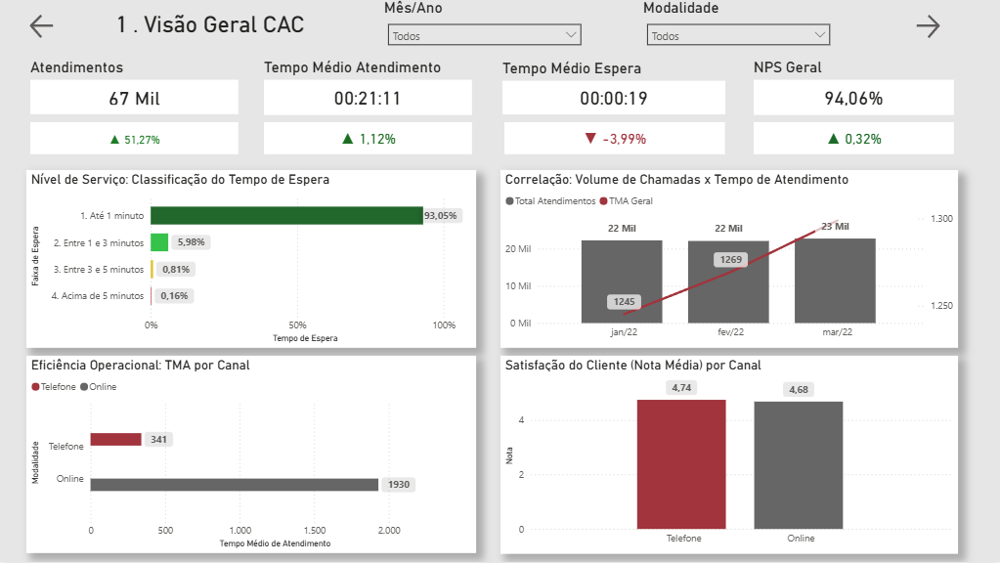
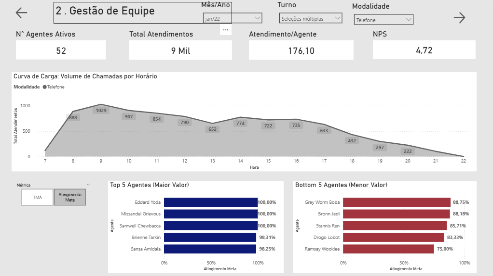
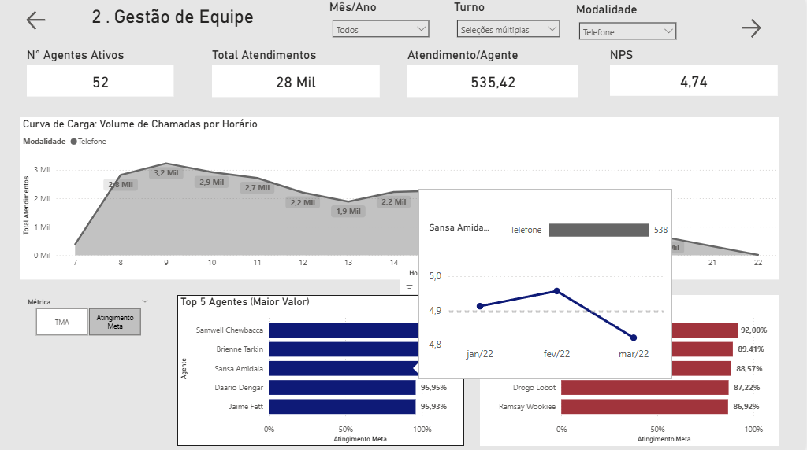
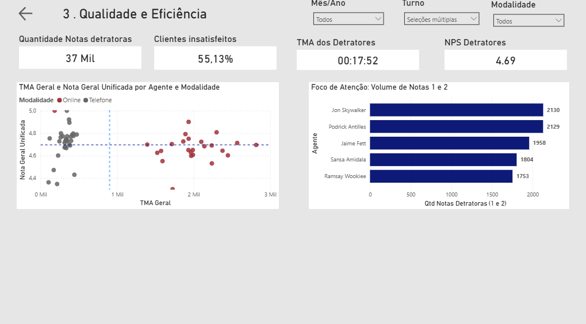

Desafio Técnico - Analista de Dados (VirteX)

Este repositório contém a solução desenvolvida para o desafio de Business Intelligence da VirteX. O projeto consiste em um Dashboard analítico para gestão de uma Central de Atendimento ao Cliente (CAC), integrando dados de telefonia e atendimento online para gerar inteligência operacional e estratégica.

## Galeria do Projeto

### 1. Visão Geral Operacional
Monitoramento de KPIs macro (Volume, TMA, TME) e análise de correlação entre demanda e tempo de resposta. Destaque para a classificação automática do Nível de Serviço.

### 2. Gestão de Equipe e Turnos
Análise de produtividade por escala de trabalho. Inclui gráfico de "Curva de Carga" para identificar picos de atendimento e seletores dinâmicos para alternar entre ranking de Eficiência e Qualidade.

### 3. Matriz de Qualidade & Estratégia
Página diagnóstica focada em identificar talentos e ofensores. Utiliza um "Quadrante Mágico" (Scatter Plot) para cruzar Tempo de Atendimento vs. Satisfação (NPS).
